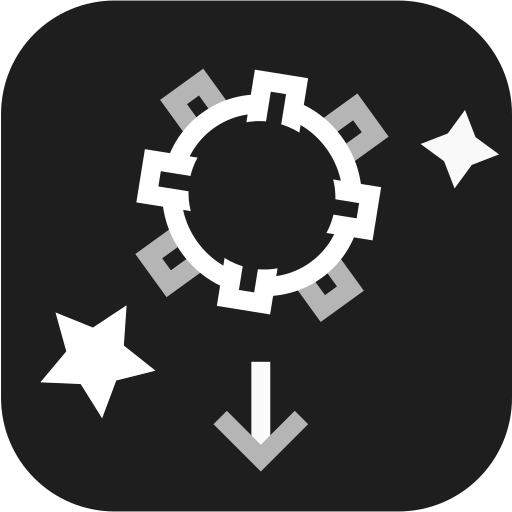

  

   [](https://github.com/Defective4/TUI-Mines/actions)     [](https://github.com/Defective4/TUI-Mines/releases)     
[Releases](https://github.com/Defective4/TUI-Mines/releases) | [**Installation**](#-installation) | [Share your theme/replay](#-share-your-theme-or-replay)

#  Description

TUI Mines is a game created for the **Java Jam** hosted at [Java Community](https://discord.com/invite/X3NmMgzFKF)
Discord
server.  
It's a Minesweeper clone designed to run entirely in terminal.  
The game also has its own terminal emulator that can be used as an alternative.

[](https://discordjug.net/)

#  Features

- Playable without any GUI in a headless environment
- All classic mechanics from Minesweeper, including chording
- Ability to customize the difficulty
- Theming - choose premade themes or create your own!
- Replays - record, replay and share your games
- [User driven themes and replays repository](https://github.com/Defective4/TUI-Mines-Repo)
- Discord integration (Rich presence)

#  Installation

|           Contents            |
|:-----------------------------:|
| [Requirements](#requirements) |
|      [Windows](#windows)      |
|        [Linux](#linux)        |
|        [Other](#other)        |

## Requirements

On all platforms the Java Runtime Environment is required to run the TUI Mines.  
The lowest required version of JRE is **1.8**.  
The game was tested on all JRE versions from `1.8` to `17` inclusive.

## Windows

To play TUI Mines on Windows it is recommended to download the executable file (.exe) from the [Releases page](https://github.com/Defective4/TUI-Mines/releases).  
Alternatively you can download the universal JAR file.

## Linux

### (Recommended) Install from Debian repository

You can download the game from my Debian repository.
To do so:

1. Add the repository to your system

```shell
sudo curl https://debian.racuszki.pl/api/packages/Defective/debian/repository.key -o /etc/apt/trusted.gpg.d/github-Defective.asc
echo "deb https://debian.racuszki.pl/api/packages/Defective/debian stable main" | sudo tee -a /etc/apt/sources.list.d/github-defective.list
sudo apt update
```

2. Install TUI Mines using APT

```shell
sudo apt-get install tui-mines
```

### Manual installation

To install TUI Mines without adding any repositories you can download the Debian package (or universal JAR if you don't
want to install/don't have root privileges) from the [Releases page](https://github.com/Defective4/TUI-Mines/releases).

## Other

TUI Mines should be able to run on any platform that can run Java applications.  
It was confirmed to run in Termux on Android.

#  Building from source

## Requirements

You have to install [Apache Maven](https://maven.apache.org/download.cgi) and **Java Development Kit 1.8** (I
recommend [Adoptium](https://adoptium.net/temurin/archive/?version=8) for Windows users) to compile TUI Mines from
source.  
Also [Git](https://git-scm.com/downloads) is recommended to clone the repository, but you can also download it manually.

## Building

1. Clone/Download and navigate to the repository
   ```shell
   git clone https://github.com/Defective4/TUI-Mines
   cd TUI-Mines
   ```
2. Build the project using Maven
    ```shell
    mvn clean package
    ``` 
3. After successful build you will find built exe  
   and `jar-with-dependencies` in the `target`
   directory

#  Share your theme or replay

### [User assets repository](https://github.com/Defective4/TUI-Mines-Repo)

You can share your themes and replays in a separate repository (see link above).  
Instructions on how to share are also included.  
All shared assets are available for viewing and downloading using **in-game browser**.

#  Technical information

## Libraries used

- **[Lanterna](https://github.com/mabe02/lanterna)** - curses-like library for terminal user interfaces
- [GSON](https://github.com/google/gson) - JSON parser library. Used to store user preferences and themes
- [sqlite-jdbc](https://github.com/xerial/sqlite-jdbc) - SQLite driver for JDBC. Used to store leaderboards.
- [discord-rpc](https://github.com/Vatuu/discord-rpc) - Discord Rich Presence integration.

### Tools

- Sound effects created using [LMMS](https://lmms.io/)
- All graphics were created in [Inkscape](https://inkscape.org/)

## Replay file format

TUI Mines uses its own file format for storing replays.  
It is documented [here](Replay%20format.md)
